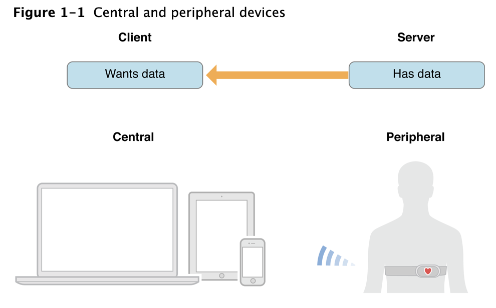

# Core Bluetooth Overview

###블루투스 통신에서 Central과 Peripheral들의 역할

Bluetooth 통신에는 크게 Peripheral, Central 2가지가 있다. 

client-server architecture를 기반으로 보자면, 아래 그림과 같다. Peripherals은 다른 기기들이 필요한 데이터를 가지고 있고, Central은 Peripheral에게 전달 받은 데이터를 가지고 특정 Task들을 수행한다. 

### Central이 Peripheral을 찾고 연결하는 법

Peripheral들은 그들이 갖고 있는 데이터를 packing하여 broadcast한다. Peripheral들은 자신의 이름과 기초적인 기능들을 담은 데이터들을 packing하여 주변에 알린다. 예를 들면 디지털 온도계는 현재 방안의 온도를 제공한다. Advertising은 Peripheral들의 존재를 알리는 기본 방법이다. 

반면에, Central은 자신이 원하는 Peripheral의 Advertising된 정보를 scan하고 listen 할 수 있다. 

아래의 그림처럼 Central은 advertising하고 있던 Periphral을 발견하여 connect를 요청 할 수 있다.

### Peripheral은 어떤 데이터 구조로 이루어져 있는가.

Peripheral에 connect를 하기 위해서는 그들이 제공하고 있는 데이터를 exploring하고 interacting해야 한다. 이러한 절차를 이해하기에 앞서 Peripherals의 데이터 구조를 살펴보자. 

Peripheral은 하나 이상의 Service를 가지고 있거나, 연결되어 있는 신호 세기의 정보를 제공한다. Service는 기능을 수행하기 위한 행동이나 Device의 특징들을 포함한 데이터로 구성되어 있다. 예를 들면, 심박수의 서비스는 심박 데이터를 노출시켜준다. 

Services 자체는 characteristics 혹은 다른 서비스에 대한 참조로 구성되어 있다. Characteristic은 Peripheral의 Service에 대해 더 자세하게 제공한다. 아래의 그림을 예로 들면, 심박수 Service는 몸에서 심박센서의 위치만 설명하고 있는 한개의 Characteristic과 측정된 심박수를 제공하는 Characteristic으로 이루어져 있다. 

### Central이 Pheripheral의 Data를 Explore하고 Interact 하는 법

Central이 Peripheral과 연결이 되면, Peripheral이 제공하는 모든 Service와 Characteristic를 발견 할 수 있다. (Advertising된 데이터들은 사용가능한 것 중 일부만이 제공될 수 있다.) 

Central은 Service의 Characteristic의 value를 write와 read가 가능해진다. 예를 들면, 당신의 앱은 디지털 온도계에 현재의 방 온도를 얻을 수 있고, 또한 온도를 설정 할 수 있다. 