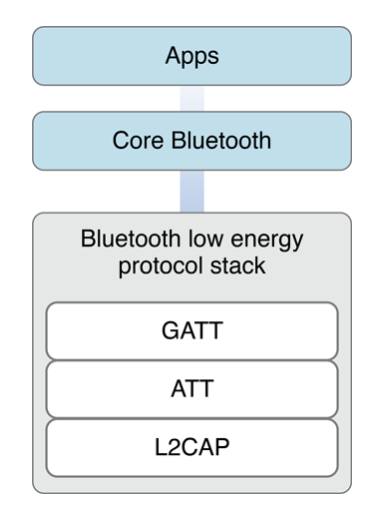

https://developer.apple.com/library/archive/documentation/NetworkingInternetWeb/Conceptual/CoreBluetooth_concepts/AboutCoreBluetooth/Introduction.html#//apple_ref/doc/uid/TP40013257-CH1-SW1

# Introduction

CoreBluetooth framework는 iOS와 Mac이 블루투스 장비와 통신하기 위한 Class들을 제공해준다. 이것들을 통해 peripheral devices를 발견하고 조회하고 통신이 가능하도록 도와준다. 

#### At a Glance

Bluetooth low energy wireless technology은 BLE 4.0 기반이다. Low-Energy들과 통신하도록 프로토콜이 정의되어 있다. The Core Bluetooth framework는 Bluetooth low energy protocol stack을 추상화했다. 개발자들이 블루투스 기기와 통신을 더욱 쉽게 하도록 말이다.

### Centrals and Peripherals Are the Key Players in Core Bluetooth

Bluetooth low energy 통신에서는 **central**과 **peripheral** 이 두가지가 핵심이다. 서로 다른 역할을 가지고 있는데, peripheral은 일반적으로 다른 device들이 필요로 하는 데이터들을 가지고 있다. central은 peripheral이 제공해주는 정보들을 some task들을 수행하기 위해 사용한다.  

예를 들면, 블루투스 디지털 온도계는 iOS앱에 방의 온도를 전달해준다. 

각각 역할을 수행할 때, task 설정을 다르게 한다. Peripherals은 무선으로 데이터를 알려 존재를 알린다. Centrals은 근처에 찾고자하는 Peripherals를 찾는다. Centrals이 원하는 Peripheral를 발견하면, connect를 시도한다. 그리고 Peripheral의 데이터를 exploring하고 interacting하기 시작한다. 

**Relevalnt Chapter: [Core Bluetooth Overview](<https://github.com/wjdgo813/About_CoreBluetooth/blob/master/CoreBluetooth_Overview.md>)**

### Core Bluetooth Simplifies Common Bluetooth Tasks

Core Bluetooth framework은 Bluetooth 4.0의 구체화 된 내용을 추상화 하여 제공한다. 만약 central 역할 하는 앱을 만든다면, Core Bluetooth는 Peripheral들을 발견하고 연결하는데 쉽게 만들어 준다. 또한 Peripheral을 explore하고 통신하는데 도와준다. 거기에 CoreBluetooth는 peripheral의 역할을 하는데에도 도와준다.

**Relevant Chapters: [Performing Common Central Role Tasks](<https://github.com/wjdgo813/About_CoreBluetooth/blob/master/Performing_Common_Central_Role_Tasks.md>), [Performing Common Peripheral Role Tasks](<https://github.com/wjdgo813/About_CoreBluetooth/blob/master/Performing%20Common_Peripheral_Role_Tasks.md>)**

### iOS App States Affect Bluetooth Behavior

당신이 만든 앱이 백그라운드에 진입하거나 suspended 상태가 되었다면, 블루투스와 관련된 것들은 모두 영향 받는다. 보통, 앱들은 백그라운드에 들어가거나 suspended 상태가 되면 Bluetooth low energy와 연관된 일들은 수행 할 수 없다. 즉, 백그라운드에서도 블루투스 작업이 필요하다면, 백그라운드 모드 중 Peripheral이나 Central을 지원하도록 선언해야 한다. 한개 이상의 백그라운드 모드를 선언하여 작동되게 했다면, 앱이 백그라운드에있는 동안 Bluetooth 작업이 다르게 작동한다는 것을 고려해야 한다. 

백그라운드를 지원하는 앱이라 하여도, 시스템이 포그라운드 메모리 확보를 위해 언제든 종료할 수 있다. iOS 7부터 Core Bluetooth는 central 혹은 peripheral 상태 정보를 저장하고, 앱이 실행 될 때 해당 상태로 복원한다. 

**Relevant Chapters: [Core Bluetooth Background Processing for iOS Apps](<https://github.com/wjdgo813/About_CoreBluetooth/blob/master/CB_Background_Processing.md>)**

### Follow Best Practices to Enhance the User Experience

Core Bluetooth framework는 블루투스 관련 많은 트랜잭션을 수행하도록 앱 개발자에게 지원하고 있다. 이번 스텝을 따라하며 사용자에게 더 좋은 UX를 제공하길 바란다. 

예를 들면, Peripheral이나 Central을 구현한 앱의 일 들은 온보드의 라디오를 이용하여 무선으로 통신을 한다. 하지만 무선으로 통신하는 대부분의 기기들은 라디오를 통해 통신이 이루어 지고, adverse하는 행위가 배터리 소모를 많이 일으킨다. 그래서 항상 최적화를 염두에 두고 설계를 해야한다. 

**Relevant Chapters:** [Best Practices for Interacting with a Remote Peripheral Device](https://github.com/wjdgo813/About_CoreBluetooth/blob/master/Best_Practices_Remote_Peripheral Device.md)

